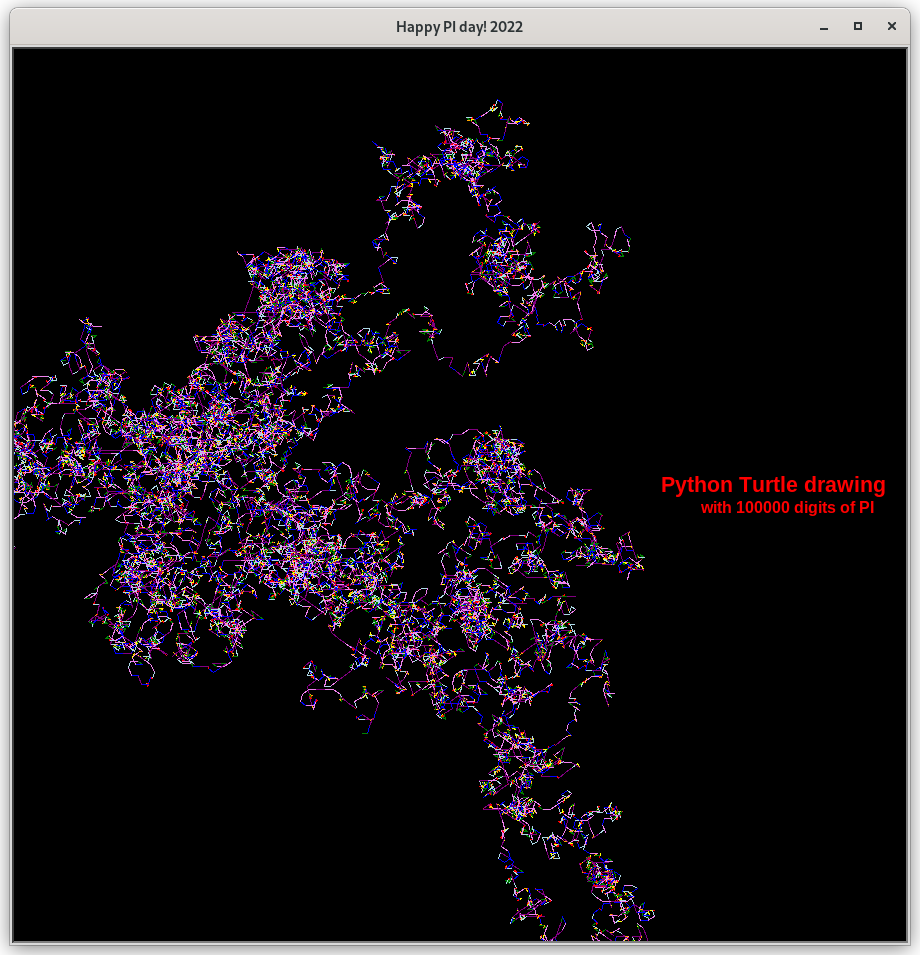

pi-day-2022-with-py

# Draw with digits of pi using a Python turtle


## Approach
For each digit of pi, display using a turtle as colored line segments mapped from a pallette.

1. Change pen color to pallete entry associated with _pi digit_
1. Move turtle forward _pi digit_ # of units
1. Turn turtle left (_pi digit_ + 1) * 36 degrees


## Run It
```
$ ./create_env
$ python -m display_pi --help
Usage: display_pi [--palette COLORS] [--num-digits N] [--width W] [--height H] [--help] [--version]

Options:
    --palette COLORS    where COLORS is a comma separated list of color names representing digits 0-9 [default: black,crimson,red,orange,yellow,green,lightblue,blue,violet,purple]
    --num-digits N      the number of digits of PI to display [default: 100_000]

    --width W           the width of the display [default: 900]
    --height H          the height of the display [default: 900]

    --help              display this help text and exit
    --version           display version and exit

$ python -m display_pi --version
3.141592653589793

$ python -m display_pi

```

